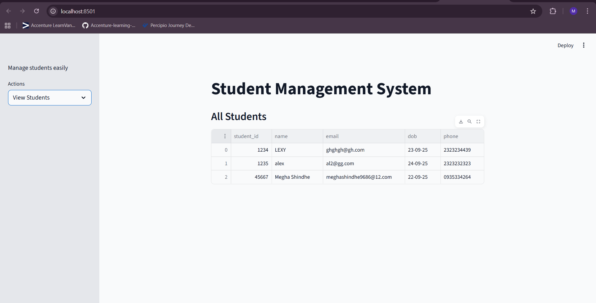
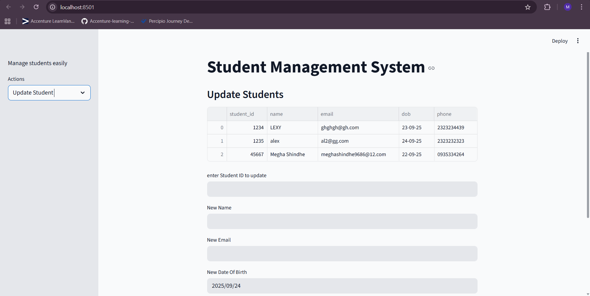
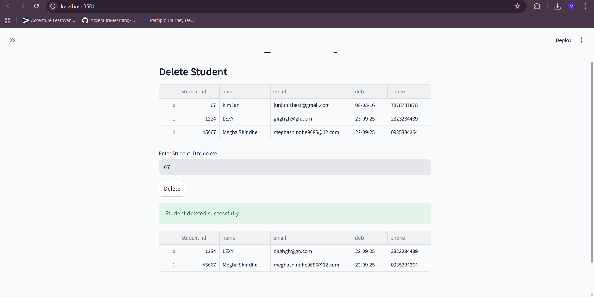

# Student-Management-System
A simple **Student Management System** built with **Python, Streamlit, and MySQL**.
It demonstrates **CRUD operations (Create, Read, Update, Delete)** with basic validations.

---

## Features
- Add, View, Update, Delete students
- Validations for numeric ID, email format, phone number
- Calendar input for Date of Birth
- Simple and user-friendly Streamlit UI

---

## Setup

### Clone the repo

bash

git clone https://github.com/meghashindhe/Student-Management-System.git

cd Student-Management-System

---

### Install dependencies

bash

pip install streamlit pandas pymysql

---

### Create database in MySQL

sql

CREATE DATABASE student_db;

USE student_db;

CREATE TABLE students (
    student_id INT PRIMARY KEY,
    name VARCHAR(100) NOT NULL,
    email VARCHAR(100) UNIQUE,
    dob DATE,
    phone VARCHAR(15)
);

Update MySQL credentials in db.py

def create_connection():
    conn = pymysql.connect(
        host="localhost",
        user="your_username",
        password="your_password",
        database="student_db",
        ssl_disabled=True
    )
    return conn

---

### Run the app

streamlit run start.py

---
## Screenshots

### Add Student Page  

  

### View Students Page  
  

### Update Student Page  
  

### Delete Student Page  
 

---
## Demo video
[Demo Video (Google Drive)](https://drive.google.com/file/d/1Y66xWe-gfRDPY1sgfoGi0Jims-dP1nDF/view?usp=sharing)

---

## Author

Megha Shindhe
[Contact](www.linkedin.com/in/meghashindhe)
